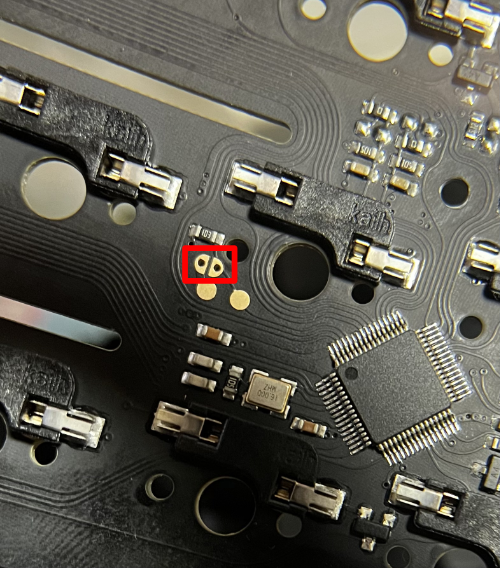

# tps40
Only non-Bluetooth models have been tested.
I do not have a Bluetooth model, so I cannot support it.

## build
```
$ qmk compile -kb tps40 -km default
```

## backup factory firmware
1. Unplug the USB connector from the TPS40.
2. Remove the PCB from the case.
3. Insert the USB connector while keeping the pad with the red frame in the image short-circuited.
   
4. Check that dfu-util detects it.
   ```
   $ dfu-util -l
   ```
5. Download firmware from the PCB
   ```
   $ dfu-util -a 0 -d 2e3c:df11 -s 0x8000000 -U backup.bin
   ```

## Write firmware
1. Unplug the USB connector from the TPS40.
2. Remove the PCB from the case.
3. Insert the USB connector while keeping the pad with the red frame in the image short-circuited.
   
4. Check that dfu-util detects it.
   ```
   $ dfu-util -l
   ```
5. Write firmware
   ```
   $ dfu-util -a 0 -d 2e3c:df11 -s 0x8000000:leave -D tps40_default.bin
   ```

## LED
1: CAPS LOCK
2-3: Layor indicator