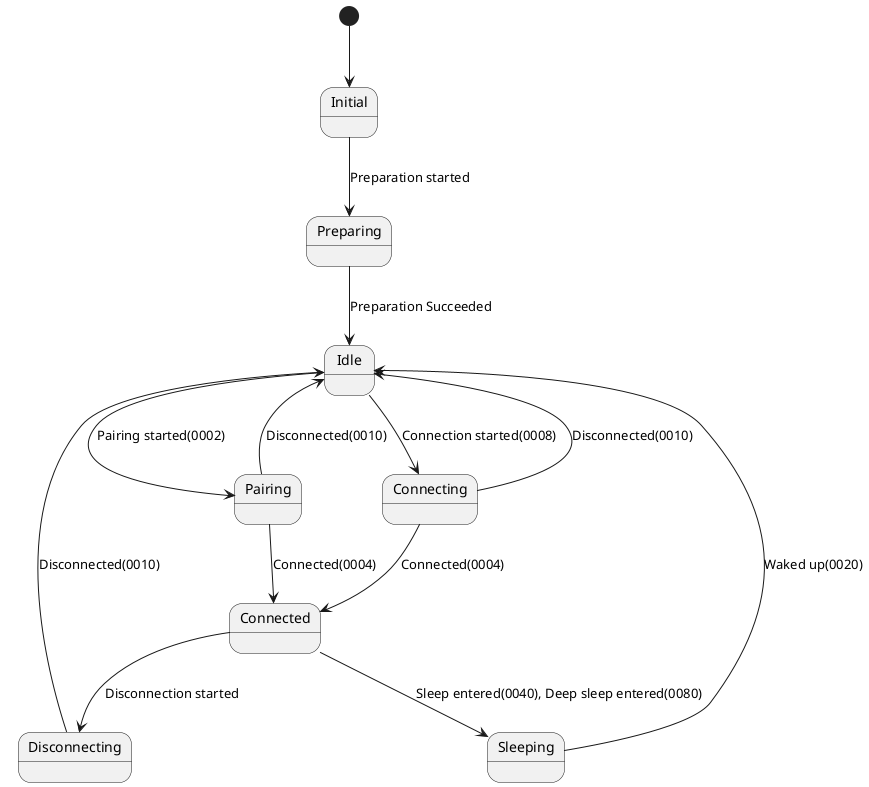

# TPS40 BT State machine

```plantuml
@startuml
[*] --> Initial
Initial --> Preparing : Preparation started
Preparing --> Idle : Preparation Succeeded
Idle --> Pairing : Pairing started(0002)
Idle --> Connecting : Connection started(0008)
Connecting --> Connected : Connected(0004)
Connecting --> Idle : Disconnected(0010)
Pairing --> Connected : Connected(0004)
Pairing --> Idle : Disconnected(0010)
Connected --> Disconnecting : Disconnection started
Disconnecting --> Idle : Disconnected(0010)

Connected --> Sleeping : Sleep entered(0040), Deep sleep entered(0080)
Sleeping --> Idle : Waked up(0020)

@enduml
```